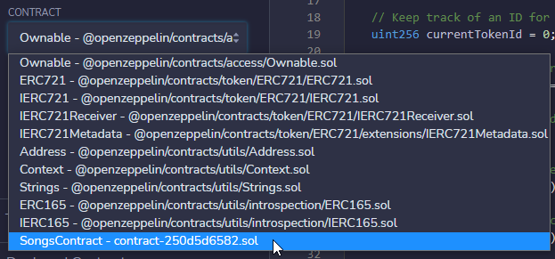

# Follow-Along - Smart Contract
Follow the instructions below to write code for a smart contract!

## Getting Started with Remix
**Remix** is an online IDE (**I**ntegrated **D**evelopment **E**nvironment) for Ethereum. Basically, it's a place where you can write smart contracts, and test them out!

### Basic Rundown
Start by walking through the interactive tour of Remix.

1. [Click here to go to Remix](https://remix.ethereum.org/)
1. Click through the opening pop-up - either option is fine  
  
1. Click "Next" on the "Welcome to Remix" pop-up  
  
1. The next pop-up shows where the compiler is - this is where code is saved and built  
  
1. The pop-up after that shows where the deployment is - this is where you can test out the smart contracts you've built  
  

### Running Code
Now it's time to run some code!

1. On the left side of the screen, click the "Files" menu, open the "Contracts" folder, and click on the **1_Storage.sol** file to open it  
  
1. Take a look at the code - there is a **number**, a **store** function, and a **retrieve** function  
  - Don't worry if this doesn't make too much sense!
1. Save and build the code by opening the "Compiler" menu, and clicking the "Compile 1_Storage.sol" button  
  
1. Now, test the code by opening the "Deploy" menu, and clicking the "Deploy" button  
  
1. The contract is live! Scroll down and open it up to see how it looks  
  
1. Enter a number, and click the "store" button
1. Click the "retrieve" button, and verify that the stored number appears!

This contract is quite simple, but it shows the basic flow of Remix - write code, compile it, and deploy it.

## Song Lyrics NFT - Using the Deployment
Now that the basic stuff is out of the way, it's time to get into something a little more interesting.

### Deploying the Songs Contract
There is an existing smart contract that contains NFTs for songs. Don't worry too much about the code - it's okay if none of it makes sense! Start by exploring the deployed application.

<div id="pre-remix-code" style="display: none">
  Note: Changing the code in the JS block below will update the "Click here to open new code" remix link.
  Also, the code is actually Solidity and not JS, but the syntax highlighting is pretty much the same.
</div>

```js
// SPDX-License-Identifier: Unlicense
pragma solidity ^0.8.4;

import "@openzeppelin/contracts/token/ERC721/ERC721.sol";
import "@openzeppelin/contracts/access/Ownable.sol";

// Data about each song
struct Song {
    string name;
    string lyrics;
}

// Contract
contract SongsContract is ERC721, Ownable {
    // What does it cost to create a new NFT?
    uint256 public mintPrice;

    // Keep track of an ID for each token
    uint256 currentTokenId = 0;

    // Check if minting is currently allowed
    bool public isMintEnabled = false;

    // Our list of songs stored as NFTs
    Song[] public songs;

    // Mapping song IDs to owners - see who owns a given song
    mapping(uint256 => address) public songOwners;

    // Mapping owners to song count - see how many songs someone owns
    mapping(address => uint256) public ownerSongCount;

    // Set the name and symbol of the token
    constructor() payable ERC721("SongMint", "SNG") {
        // Set the price
        mintPrice = 50000 wei;
    }

    // Function to enable and disable minting
    function toggleIsMintEnabled() external onlyOwner {
        isMintEnabled = !isMintEnabled;
    }

    // Function to get the lyrics for a given song name
    function getLyricsForSong(string calldata songName) external view returns(string memory lyrics) {
        // Loop through each song in the list
        for (uint256 i = 0; i < songs.length; i++) {
            // If we found the song we are looking for...
            if (keccak256(abi.encodePacked(songs[i].name)) == keccak256(abi.encodePacked(songName))) {
                // Return the lyrics for the song!
                return songs[i].lyrics;
            }
        }

        // We couldn't find a song with that name :(
        return "No song found";
    }

    // Find all the songs owned by a given address
    function getSongsByOwner(address owner) public view returns(uint256[] memory) {
        // Create a new list
        uint256[] memory result = new uint256[](ownerSongCount[owner]);

        // Setup a counter to keep track of how many songs we have
        uint256 counter = 0;

        // Loop through each song
        for (uint256 i = 0; i < songs.length; i++) {
            // If the owner owns this song...
            if (songOwners[i] == owner) {
                // Add the song ID to the list
                result[counter] = i;

                // Make the counter go up by one
                counter++;
            }
        }

        // Return the list
        return result;
    }

    // Create the NFT based on the song name and song lyrics
    function mint(string calldata songName, string calldata songLyrics) external payable {
        // Check if minting is enabled
        require(isMintEnabled, "minting not enabled");

        // Check if the caller provided the proper amount of currency
        require(msg.value == mintPrice, "wrong value");

        // Make sure a song with this name does not already exist
        require(!songNameExists(songName), "song with that name already exists");

        // Make sure a song with these lyrics does not already exist
        require(!songLyricsExists(songLyrics), "song with those lyrics already exists");

        // Make a new song with the name and lyrics, and add it to our list
        Song memory newSong = Song(songName, songLyrics);
        songs.push(newSong);
        
        // Set the owner of the new song to be the caller
        songOwners[currentTokenId] = msg.sender;
        ownerSongCount[msg.sender]++;

        // Mint the NFT!
        _safeMint(msg.sender, currentTokenId);

        // Update our current token ID for next time
        currentTokenId++;
    }

    // Helper function - check if a song with the given name already exists
    function songNameExists(string calldata songName) private view returns(bool exists) {
        for (uint256 i = 0; i < songs.length; i++) {
            if (keccak256(abi.encodePacked(songs[i].name)) == keccak256(abi.encodePacked(songName))) {
                return true;
            }
        }

        return false;
    }

    // Helper function - check if a song with the given lyrics already exists
    function songLyricsExists(string calldata songLyrics) private view returns(bool exists) {
        for (uint256 i = 0; i < songs.length; i++) {
            if (keccak256(abi.encodePacked(songs[i].lyrics)) == keccak256(abi.encodePacked(songLyrics))) {
                return true;
            }
        }

        return false;
    }
}
```

1. <a id="remix-url" target="_blank">Click here to open the new code in Remix</a>
1. Select the "Compile" menu on the left, and click the "Compile" button
1. Go to the "Deploy" menu on the left
1. In the dropdown under "CONTRACT", select "SongsContract"  
  
1. Click the red "Deploy" button
1. Under that, Find the "Deployed Contracts" section, and expand SONGSCONTRACT  
  

All of the buttons and inputs that appear below constitute the user interface for the Songs contract!

### Testing the Contract - Minting
Now it's time to test out the contract and mint some NFTs!

1. Expand the red "mint" function section  
  
1. Enter a song title and the first line of a song (not the whole lyrics)
1. Click the red "transact" button  
  

Uh-oh! Looks like something went wrong. Take a look in the console below the code section - there should be a message like this:

```
revert
	The transaction has been reverted to the initial state.
Reason provided by the contract: "minting not enabled".
Debug the transaction to get more information.
```

The important piece is the "minting not enabled" message. The contract needs minting to be enabled first! **Find and click the orange "toggleIsMintEnabled" button to enable minting**. It may only say "toggleIsMintE..." because the button does not have space for the full function name:


Once minting has been enabled, go back up to the "mint" function section, and try clicking the red "transact" button again...

Oh no, there's still an issue! The good news is, this issue is a different one. Check the console to see why the transaction failed:

```
revert
	The transaction has been reverted to the initial state.
Reason provided by the contract: "wrong value".
Debug the transaction to get more information.
```

This time, "wrong value" is the reason the transaction failed. This is an important lesson! In Ethereum, transactions like minting NFTs are associated with some form of payment. Make sure that the value provided is equal to the price.

1. In the deployed contract, scroll down and click the blue "mintPrice" button  
  
1. Check the number that appears below the button - it should say `0: uint256: 50000`
  - The important part there is the **50000**!
1. Scroll back up to the top of the "Deploy" section, and find the "VALUE" field
  - Note that this is in [_Wei_](https://www.investopedia.com/terms/w/wei.asp) - basically, a very very small amount of ether
  - Don't worry, this is a test network - it won't cost any real money!
1. Enter **50000** for the value  
  
1. Go back down and click the red "transact" button in the "mint" section again - this time it should work!

You have successfully minted a new Song NFT! Take a minute to mint a few more songs, keeping a few things in mind:

- Always make sure to set the value to **50000 wei**
- Trying to mint a song that already exists will cause an error
- Feel free to make up your own songs and lyrics, or copy and paste full lyrics!

### Testing the Contract - Viewing
Now that the blockchain has stored some new songs, it's possible to view them. When minted, each song is automatically given an ID number, starting at **0**. This will be the main way to access each song.

#### Songs by ID
1. Scroll down to the blue "songs" button
1. Enter **0** into the field (this is the song id)
1. Click the button to see the first minted song!  
  
1. Try entering **1**, **2**, etc to see other songs that have been minted

#### Song Owners
1. Scroll up to the blue "ownerOf" button
1. Enter a song id (like **0**)
1. Click the button to see which address owns the first minted song!  
  

#### Song Lyrics from Name
1. Scroll up to the blue "getLyricsForSong" button (it may say "getLyricsForSo...")
1. Enter a song name for a minted song - make sure the capitalization is correct
1. Click the button to see the lyrics!  
  

#### Optional - More Functions
There are several additional functions to explore as well! To test transactions between addresses, it will be necessary to change the account/address calling the functions. This is possible at the top of the "Deploy" section:


Here are some of the other possibilities:
- Blue "getSongsByOwner" button - see which songs are owned by a given address
- Blue "balanceOf" button - see how many tokens are owned by a given address
- Orange "transferFrom" button - transfer an owned token from one address to another

## Song Lyrics NFT - Updating the Code
Let's dig into the code a little bit and make some updates. It is not necessary to fully understand the code in the **.sol** file - just follow along with the updates and watch how they change the functionality of the deployment!

### Adding an Artist Field
In most music databases, each song will typically be associated with an artist! We can add that capability to our NFT as well.

1. At the top of the code file (on line **8**), find `struct Song`
  - Notice there are two things listed under that - `string name;` and `string lyrics;`
1. Following that pattern, add a field for artist

The code at the top should look something like this:

```cs
// Data about each song
struct Song {
    string name;
    string lyrics;
    string artist;
}
```

This will actually cause an issue in the compiler - select the "Compiler" section from the left menu, and see that the error appears to be on line **99**. This is where the new song is created - but it currently doesn't have an artist! There are a couple of things that need to be fixed.

1. On line **99**, add `songArtist` at the end of the list within `Song()`:  
  ```java
  Song memory newSong = Song(songName, songLyrics, songArtist);
  ```
1. Notice that this causes another error - `songArtist` needs to be passed in as an input
1. On line **85**, see how the other input fields for `songName` and `songLyrics` are created
1. Add another input field in the same way, for `string calldata songArtist`:  
  ```cs
  function mint(string calldata songName, string calldata songLyrics, string calldata songArtist) external payable {
  ```

Now the code should work! Test it out by following these steps:

1. Click the "Compile" button
1. Select the "Deploy" section from the left menu
1. Down in the "Deployed Contracts" area, click the trash can to delete the existing contract  
  
1. Click the red "Deploy" button
1. Expand the newly deployed contract
1. Click the orange "toggleIsMintEnabled" button
1. Expand the "mint" section
1. Enter information for a new song (including artist this time!)
1. Set the VALUE to **50000**
1. Click the red "transact" button  
  

It should now be possible to explore the songs on the blockchain with artists!


Changing only a few lines of code had a pretty big impact on the deployed contract!

### Optional - Adding More Requirements
In the current version of the application, it is actually possible to enter _nothing_ for the song name, lyrics, and artist. Let's add some code to fix that!

1. In the code, within the `mint` function, find the `require(!songLyricsExists(songLyrics), "song with those lyrics already exists");` line (should be around line **96**)
1. Make some new lines under that - this is where the new `require`ments will go
1. Add the following code to force the length of the song name to be greater than 0:  
  ```js
  require(bytes(songName).length > 0, "song name must not be empty");
  ```
1. Add another new line, and do the same thing - but this time, with `songLyrics`
  - Change the message so that it reflects the new requirement
1. Add yet another line, and do the same thing again - but with `songArtist`
  - Change the message so that it reflects the new requirement
1. Under that, add a very similar line of code to make sure the song name is not too _long_:  
  ```js
  require(bytes(songName).length < 40, "song name too long");
  ```
1. Do the same thing for `songLyrics` and `songArtist` - feel free to choose custom length maximums and messages!

The code for these requirements should end up looking something like this:

```js
require(bytes(songName).length > 0, "song name must not be empty");
require(bytes(songLyrics).length > 0, "song lyrics must not be empty");
require(bytes(songArtist).length > 0, "song artist must not be empty");
require(bytes(songName).length < 40, "song name too long");
require(bytes(songLyrics).length < 500, "song lyrics too long");
require(bytes(songArtist).length < 40, "song artist too long");
```

With just a few more lines of code, the contract is much more robust.

## Next Steps
After the follow-along activity, be sure to check out the [self-paced work](SelfPacedWork.md) to continue practicing and learning!