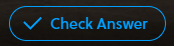
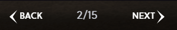

# Self-Paced Work - CryptoZombies
CryptoZombies is an interactive Solidity tutorial with several sections. Walk through some of the lessons to continue learning!

A few things to keep in mind:
- Don't worry about understanding the code - focus more on the concepts
- It is possible to reveal the code for each section by clicking "Check Answer" and then "Show me the answer" at the bottom of the page:  
  
  
- It is also possible to simply skip a section by clicking the "NEXT" button in the bottom right:  
  
- Skip to **Chapter 14** in Lesson 1 to play around with the contract it builds

[Click here to go to Lesson 1!](https://cryptozombies.io/en/lesson/1/chapter/1)